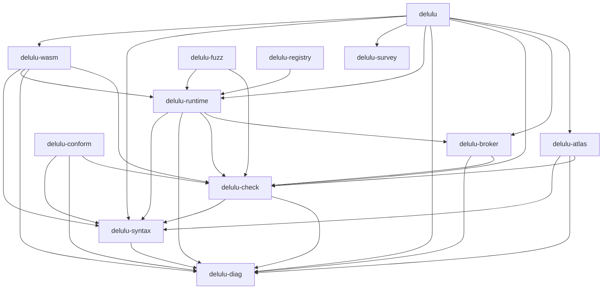

# The DeluluLang Survey

**Generated — do not edit by hand.** Regenerate with `cargo run -p delulu-survey -- build`.

This is the map of the *repository*: what the parts are, how they actually depend on one
another, and where a given kind of question is answered. It is derived only from the
repository's own text.

> **The provenance law.** Every edge in this map names the file and line it was read from,
> and every edge whose target is a path was checked to exist. Nothing here is inferred from
> name similarity, embeddings, or proximity. A relation that cannot be pointed at in the
> text is not in the map — it is a [discrepancy](DISCREPANCIES.md) instead.

Not to be confused with the **Atlas** (`crates/delulu-atlas`), which maps a checked Delulu
*program* from compiler facts. The Atlas needs the compiler to work; the Survey reads
files, so it still opens when the tree does not build.

## Measured facts

| | |
|---|---:|
| Workspace members | 13 |
| … shipped language crates | 9 |
| … repository tooling (`publish = false`) | 4 |
| Rust files | 236 |
| Rust lines | 119349 |
| Rust files outside `src/` (test/bench targets) | 99 |
| Markdown documents | 186 |
| Markdown lines | 52211 |
| DeluluLang programs | 154 |
| Registered diagnostic codes | 154 |
| Recorded rulings | 144 |
| Recorded campaign findings | 92 |
| Nodes / edges in this map | 1165 / 10770 |
| Open discrepancies | 27 |

Lines are counted as text lines. Test *counts* are not here: the number of passing tests
is produced by `cargo test`, not by reading files, and the Survey does not restate numbers
it did not measure.

## How the crates depend on each other

Read from the `path = "../…"` entries in each `Cargo.toml`.



## The crates

### `delulu`

The DeluluLang CLI: check | run | repl | authority

- **Depends on:** `delulu-atlas`, `delulu-broker`, `delulu-check`, `delulu-diag`, `delulu-runtime`, `delulu-survey`, `delulu-syntax`, `delulu-wasm`
- **Depended on by:** —  ← change this crate, and these must be re-checked
- **Modules:** 26 files, 23203 lines

| Module | Lines | What it is |
|---|---:|---|
| `src/advisories.rs` | 219 | The advisory-feed detector (Stage 10 phase 10k, Track C, spec §4). |
| `src/broker_client.rs` | 453 | Phase 5f — `BrokerClientCustody`: the daemon-mode [`Custody`] impl (spec §4). |
| `src/broker_ipc.rs` | 370 | Phase 5f — the broker IPC wire protocol (spec §2, head-chef ruling 2). |
| `src/broker_transport.rs` | 568 | Phase 5f — the local IPC transport (spec §2): Windows named pipe / Unix domain socket, one |
| `src/brokerd.rs` | 2174 | Phase 5f — the broker daemon (`delulu broker start\|status\|stop\|rotate-key`) and its serve loop. |
| `src/cert_crypto.rs` | 190 | RFC 0001 phase F2 — the real signature backend for grant certificates. |
| `src/cli.rs` | 9340 | Command dispatch and the four Stage-1 commands (§9.5). |
| `src/completions.rs` | 163 | `delulu completions` — a shell completion script, generated rather than kept. |
| `src/deploy.rs` | 304 | `delulu deploy plan` — the whole-deployment authority answer, computed and checked BEFORE |
| `src/doctor.rs` | 694 | `delulu doctor` — one command that says whether this machine, and this checkout, are healthy. |
| `src/fix.rs` | 459 | `delulu fix` — apply the repairs the checker already computed. |
| `src/fleet.rs` | 541 | Stage 10 phase 10j — Track H, §9.3: fleet/OTA updates (spec §9.3, criterion 9's fleet-update |
| `src/foreign_worker.rs` | 734 | Phase 5h — foreign workers (process isolation), redeeming Stage 4's honesty note. |
| `src/guest.rs` | 658 | The sandbox guest (PS-A-03): `delulu __guest`, the child that runs a program while holding no |
| `src/jail.rs` | 470 | PS-A-04: the OS jail around a sandbox guest. |
| `src/locale.rs` | 296 | Locale selection + the first-run experience (Stage 8, spec §6.2–§6.3). |
| `src/lsp.rs` | 1947 | `delulu lsp` — the language server (Stage 8, spec §3). Stdio, LSP 3.17, one instance |
| `src/main.rs` | 79 | The `delulu` CLI (spec §9.5). Terminal-first: everything the language can do is reachable |
| `src/microvm.rs` | 58 | Phase 5i — the microVM isolation profile (spec §6). **Linux-first, stated honestly** (playbook |
| `src/morph_file.rs` | 222 | Loading surface morphs from disk (Stage 8 §6.5; `docs/design/SYNTAX_MORPH_SPEC.md`). |
| `src/new.rs` | 312 | `delulu new` — start a package that already works. |
| `src/policy.rs` | 191 | PS-A-06: `SandboxPolicy` — what a run's confinement IS, as one value. |
| `src/repl.rs` | 153 | A pragmatic Stage-1 REPL (§9.5, acceptance criterion 1). Declarations accumulate; an |
| `src/run_cmd.rs` | 1337 | `delulu run` — the command that actually executes a program. |
| `src/sandbox.rs` | 359 | `delulu sandbox probe [--json]` (PS-0-04): which isolation levels this host can give a program |
| `src/signing.rs` | 912 | Signing + the registry client groundwork (Stage 8, phase 8h; spec §7). |

### `delulu-atlas`

The Atlas: a typed, deterministic code + authority graph derived only from Delulu compiler facts

- **Depends on:** `delulu-check`, `delulu-diag`, `delulu-syntax`
- **Depended on by:** `delulu`  ← change this crate, and these must be re-checked
- **Modules:** 6 files, 2335 lines

| Module | Lines | What it is |
|---|---:|---|
| `src/build.rs` | 525 | Build an [`Atlas`] from compiler facts — and *only* from compiler facts. |
| `src/formats.rs` | 459 | Tool + browser formats: `dot` (Graphviz), `mermaid` (module-level), and a self-contained |
| `src/lib.rs` | 279 | The Atlas — a typed, deterministic graph of a checked Delulu program, derived ONLY from |
| `src/model.rs` | 308 | The Atlas data model: typed nodes and edges, stable ids, and the versioned `atlas/1` envelope. |
| `src/query.rs` | 464 | Agent-side query verbs: `node`, `path`, `callers`, `calls`, `why`. Each answers a small |
| `src/render.rs` | 300 | Human/agent text formats for the atlas: the `tree` overview and the token-budgeted `digest`. |

### `delulu-broker`

DeluluLang custody core (Stage 5): the ⊑ attenuation lattice, the in-memory grant tree, the two validation classes with revocation epochs, the hash-chained audit log, and MAC-signed lease tokens. Transport-free — no sockets, no daemon, no runtime wiring.

- **Depends on:** `delulu-check`, `delulu-diag`
- **Depended on by:** `delulu`, `delulu-runtime`  ← change this crate, and these must be re-checked
- **Modules:** 14 files, 9422 lines

| Module | Lines | What it is |
|---|---:|---|
| `src/audit.rs` | 1090 | Phase 5d — the append-only, hash-chained audit log (spec §7, invariant 26). |
| `src/authority.rs` | 408 | Phase 5a — the `⊑` attenuation lattice (spec §A.3, R-7; Constitution §5.16 law 1). |
| `src/cert.rs` | 1716 | RFC 0001 phase F2 — the **grant certificate**: an offline, self-describing, chain-verifiable |
| `src/device_scope.rs` | 503 | RFC 0001 phase F1 — the **device** scope dimension and its lattice (build-order D12e). |
| `src/diag.rs` | 445 | Broker denials and their mapping to `delulu_diag::Diagnostic`. |
| `src/guard.rs` | 1639 | Stage 5 chunk 6 (phases 5k–5m) — **the Guard**: a dcg-inspired principal-approval layer. |
| `src/ids.rs` | 80 | GrantId sources (ruling 3: determinism injection). |
| `src/lease.rs` | 648 | Phase 5e — portable lease tokens: `delegate` / `redeem` / `rotate_key` (spec §2, §3.2). |
| `src/lib.rs` | 58 | `delulu-broker` — DeluluLang custody core (Stage 5, "Custody"). |
| `src/path.rs` | 563 | Pure-lexical path descendant semantics for the `⊑` lattice (Stage 5, spec §A.3 "path is a |
| `src/secrets.rs` | 511 | Phase 5g — the broker-resident secret store (spec §4.4, invariant 23). |
| `src/time.rs` | 56 | The pluggable TTL clock (ruling 3: determinism injection). |
| `src/tree.rs` | 1108 | Phase 5b — the in-memory grant tree (spec §3): issue / attenuate / revoke / inspect / tree. |
| `src/validate.rs` | 597 | Phase 5c — the two validation classes + revocation epochs (spec §4). |

### `delulu-check`

DeluluLang name resolution, type & effect/authority checker — the soundness core

- **Depends on:** `delulu-diag`, `delulu-syntax`
- **Depended on by:** `delulu`, `delulu-atlas`, `delulu-broker`, `delulu-conform`, `delulu-fuzz`, `delulu-runtime`, `delulu-wasm`  ← change this crate, and these must be re-checked
- **Modules:** 17 files, 14731 lines

| Module | Lines | What it is |
|---|---:|---|
| `src/authority.rs` | 120 | The whole-program authority report (spec §10.5) — the data behind `delulu authority`, |
| `src/check.rs` | 3383 | The type & effect/authority judgment (spec §6.2–§6.5). THE HEART. |
| `src/deprecation.rs` | 186 | The deprecation registry and DL1801 (Stage 9c, spec §2.2). |
| `src/deps.rs` | 1464 | Cross-package dependency resolution and whole-workspace checking (Stage 2 §3–§4). |
| `src/dir.rs` | 843 | DIR — the Delulu typed IR (Stage 6 "Live", spec §2.3). |
| `src/lib.rs` | 1965 | DeluluLang name resolution, type & effect/authority checking — the soundness core. |
| `src/lockfile.rs` | 561 | The authority lockfile (`delulu.lock`), Stage 2 §4.4. |
| `src/manifest.rs` | 389 | The canonical compile-time package manifest (`delulu.toml`), Stage 2 §3.2. |
| `src/package.rs` | 244 | Package loading and module-graph discovery (Stage 2, §3). A package is a directory with a |
| `src/plugin.rs` | 589 | `kind = "plugin"` packages: the plugin manifest tables and the manifest-vs-code fence |
| `src/prim_table.rs` | 318 | The declarative primitive-table index (Stage 9, invariant 42 — the coverage law). |
| `src/program.rs` | 592 | Whole-program (multi-module) checking (Stage 2, §5). Stage 1's `check_source` handles one |
| `src/rcap_check.rs` | 1804 | The reference-capability checking PASS (Stage 7, phases 7c–7f) — the second checking axis. |
| `src/rcaps.rs` | 747 | Reference-capability core (Stage 7, spec §3) — Pony's production-proven system, adopted |
| `src/resolve.rs` | 719 | Name resolution (spec §5): build the declaration table for a module, detect duplicates |
| `src/ty.rs` | 462 | The representation of authority in the type system (spec §6.1). |
| `src/unify.rs` | 345 | Inference context and unification (spec §6.2, audit R-3/R-3b). |

### `delulu-conform`

The DeluluLang conformance coverage law (invariant 42): delulu-conform --coverage

- **Depends on:** `delulu-check`, `delulu-diag`, `delulu-syntax`
- **Depended on by:** —  ← change this crate, and these must be re-checked
- **Modules:** 5 files, 2190 lines

| Module | Lines | What it is |
|---|---:|---|
| `src/lib.rs` | 672 | The conformance coverage law (Stage 9, invariant 42), mechanized. |
| `src/main.rs` | 109 | `delulu-conform` — the conformance coverage tool (Stage 9, invariant 42). |
| `src/reference.rs` | 340 | The generated half of the language reference (Stage 9b, spec §2.1). |
| `src/rules.rs` | 585 | The normative rule index (Stage 9b, spec §2.1) — one entry per normative statement of |
| `src/tests.rs` | 484 | Tests for the coverage tool itself (Stage 9a, house rule 3 — every check has its skip-branch |

### `delulu-diag`

DeluluLang diagnostics: spans, source map, code registry, JSON envelope, typed repairs, human renderer

- **Depends on:** —
- **Depended on by:** `delulu`, `delulu-atlas`, `delulu-broker`, `delulu-check`, `delulu-conform`, `delulu-runtime`, `delulu-syntax`, `delulu-wasm`  ← change this crate, and these must be re-checked
- **Modules:** 9 files, 3722 lines

| Module | Lines | What it is |
|---|---:|---|
| `src/catalog.rs` | 371 | The message-catalog layer (Stage 8, spec §6.1) — the localization foundation. |
| `src/codes.rs` | 1947 | The Stage-1 diagnostic code registry (spec §10.3). |
| `src/diagnostic.rs` | 196 |  |
| `src/json.rs` | 190 | The machine-facing JSON envelope (spec §10.1–§10.2). Field names and shapes are |
| `src/lib.rs` | 30 | DeluluLang diagnostics. |
| `src/palette.rs` | 606 | The Palette — a role-based color system for every human-facing CLI surface (Surface addendum |
| `src/render.rs` | 255 | Human-facing rendering. This text is presentation, not contract: it may change |
| `src/source.rs` | 96 |  |
| `src/span.rs` | 31 |  |

### `delulu-fuzz`

DeluluLang differential fuzz harness: generate programs, check them, and assert the runtime trace is a subset of the statically computed row (the Effect-Soundness theorem, fuzzed)

- **Depends on:** `delulu-check`, `delulu-runtime`
- **Depended on by:** —  ← change this crate, and these must be re-checked
- **Modules:** 3 files, 624 lines

| Module | Lines | What it is |
|---|---:|---|
| `src/danger.rs` | 276 | The danger-zone generator (campaign P17-D). |
| `src/lib.rs` | 301 | The DeluluLang differential fuzz harness (Stage 2, §7.2). |
| `src/main.rs` | 47 | `delulu-fuzz [iterations] [seed]` — run a differential fuzz campaign (spec §7.2). Default is |

### `delulu-measure`

The DeluluLang measurement program (Stage 9): the published, reproducible evidence

- **Depends on:** —
- **Depended on by:** —  ← change this crate, and these must be re-checked
- **Modules:** 6 files, 1743 lines

| Module | Lines | What it is |
|---|---:|---|
| `src/corpus.rs` | 240 | Study A's corpus: real-shaped packages with real dependency graphs (Stage 9d, spec §3.1). |
| `src/lib.rs` | 22 | The DeluluLang measurement program (Stage 9, spec §3) — the published, reproducible evidence |
| `src/main.rs` | 193 | `delulu-measure` — runs the Stage 9 measurement studies and writes their raw data. |
| `src/study_a.rs` | 463 | Study A — whole-program authority verification at scale (Stage 9d, spec §3.1). |
| `src/study_b.rs` | 441 | Study B — agent task success and repair loops (Stage 9e, spec §3.2). |
| `src/study_c.rs` | 384 | Study C — the performance honesty baseline (Stage 9e, spec §3.3). |

### `delulu-registry`

The DeluluLang package registry (Stage 9): sparse index, publish API, server-side authority recomputation

- **Depends on:** `delulu-runtime`
- **Depended on by:** —  ← change this crate, and these must be re-checked
- **Modules:** 4 files, 1591 lines

| Module | Lines | What it is |
|---|---:|---|
| `src/lib.rs` | 610 | The DeluluLang package registry (Stage 9g, spec §5). |
| `src/main.rs` | 259 | `delulu-registry` — run the package registry (Stage 9g, spec §5). |
| `src/tests.rs` | 588 | The registry's policies, tested (Stage 9g — release criterion 5). |
| `src/token.rs` | 134 | Scoped, revocable publish tokens (Stage 9g, spec §5). |

### `delulu-runtime`

DeluluLang runtime: values, capability table, Stage-1 grant broker, tree-walking interpreter

- **Depends on:** `delulu-broker`, `delulu-check`, `delulu-diag`, `delulu-syntax`
- **Depended on by:** `delulu`, `delulu-fuzz`, `delulu-registry`, `delulu-wasm`  ← change this crate, and these must be re-checked
- **Modules:** 19 files, 14364 lines

| Module | Lines | What it is |
|---|---:|---|
| `src/actors.rs` | 1159 | The native actor runtime (Stage 7 phase 7g, spec §6). |
| `src/adapter.rs` | 542 | The first real hardware adapter: a **line-protocol subprocess** (`Profile::Hw`). |
| `src/broker.rs` | 427 | The Stage-1 capability broker (spec §7.2). In Stage 1 the CLI *is* the human-controlled |
| `src/channel.rs` | 781 | `delulu-sandbox-channel/1` (PS-A-02): the wire between a guest interpreter and the host that |
| `src/compute.rs` | 654 | Stage 10 phase 10h — heterogeneous compute (Track F, spec §7, invariants 49 and 50). |
| `src/custody.rs` | 255 | Phase 5f — the `Custody` trait: the seam between the runtime and *where authority lives*. |
| `src/cycles.rs` | 230 | The per-worker cycle collector (Stage 10 phase 10d, Track B1, spec §3). |
| `src/device.rs` | 1404 | Stage 10 phase 10f — the device broker: dead-man leases, the reference simulator, and the |
| `src/foreign.rs` | 458 | Stage 4 C FFI runtime (spec §4). **Every native-dependency line in the interpreter lives here** |
| `src/interp.rs` | 2133 | The Stage-1 tree-walking interpreter (spec §7). It runs the *checked* AST, so it assumes |
| `src/lib.rs` | 442 | DeluluLang runtime: values, the capability table, the Stage-1 grant broker, and the |
| `src/netclass.rs` | 171 | Special-use network addresses (NE-18, owner ruling D-NE-28, PS-0-09). |
| `src/plugin.rs` | 2235 | The plugin loader (Stage 6 "Live", spec §3.1) — steps 1–4 land in phase 6d. |
| `src/pqc.rs` | 495 | Stage 10 phase 10i — post-quantum signatures (Track G, spec §8, invariant 51). |
| `src/prim.rs` | 1163 | The runtime primitive table (spec §7.3): the execution half of the effect truth. Every |
| `src/python.rs` | 332 | Stage 4 embedded-CPython runtime (spec §5). **Every PyO3 line in the interpreter lives here**, |
| `src/sink.rs` | 74 | The effect seam (PS-A-01): the ONE trait every capability operation passes through. |
| `src/trace.rs` | 537 | Effect tracing (spec §6.1): the executable soundness witness. Every EFFECTFUL primitive |
| `src/value.rs` | 872 | Runtime values, environments, and capability values (spec §7.1). |

### `delulu-survey`

The Survey: a measured, provenance-carrying map of the DeluluLang REPOSITORY — every edge cites the file and line it was read from

- **Depends on:** —
- **Depended on by:** `delulu`  ← change this crate, and these must be re-checked
- **Modules:** 11 files, 4404 lines

| Module | Lines | What it is |
|---|---:|---|
| `src/codeowners.rs` | 197 | `.github/CODEOWNERS` — which paths are **entrenched**. |
| `src/health.rs` | 277 | Repository health — the single place that knows what a healthy map looks like. |
| `src/lib.rs` | 652 | The Survey — a measured map of the DeluluLang **repository**. |
| `src/main.rs` | 540 | `delulu-survey` — build, query, and staleness-check the repository map. |
| `src/manifest.rs` | 242 | Cargo manifests — the ground truth for "which crate depends on which". |
| `src/mdown.rs` | 541 | Reading Markdown. |
| `src/paths.rs` | 345 | Resolving a path someone wrote in prose or a comment to a file that is actually there. |
| `src/render.rs` | 279 | The three channels the Survey publishes on. |
| `src/rust.rs` | 485 | Reading Rust source as text. |
| `src/scan.rs` | 214 | Walking the tree and deciding what each file *is*. |
| `src/verify.rs` | 632 | Cross-checking — the pass that decides whether an extracted relation is trustworthy. |

### `delulu-syntax`

DeluluLang lexer, token model, AST, and error-recovering recursive-descent parser

- **Depends on:** `delulu-diag`
- **Depended on by:** `delulu`, `delulu-atlas`, `delulu-check`, `delulu-conform`, `delulu-runtime`, `delulu-wasm`  ← change this crate, and these must be re-checked
- **Modules:** 9 files, 7574 lines

| Module | Lines | What it is |
|---|---:|---|
| `src/ast.rs` | 528 | The Stage-1 AST (spec §4). Every node that can carry a diagnostic has a `Span`; |
| `src/fmt.rs` | 1593 | `delulu fmt` — the canonical formatter (Stage 8, spec §4). One style, zero options. |
| `src/grammar.rs` | 125 | The declarative grammar-production index (Stage 9, invariant 42 — the coverage law). |
| `src/lexer.rs` | 1006 | The Stage-1 lexer (spec §2), including Go-style automatic statement |
| `src/lib.rs` | 38 | DeluluLang syntax: tokens, lexer, AST, parser (Stage-1 spec §2–§4). |
| `src/morph.rs` | 734 | Surface-syntax morphs (Stage 8 §6.5; `docs/design/SYNTAX_MORPH_SPEC.md`). |
| `src/num.rs` | 113 | The language's one rule for turning written decimal text into a `Float`. |
| `src/parser.rs` | 2970 | The Stage-1 parser (spec §3): error-recovering recursive descent with a Pratt |
| `src/token.rs` | 467 | The Stage-1 token model (spec §2). |

### `delulu-wasm`

DeluluLang WASM backend (Stage 3): compile checked programs to WebAssembly and run them under an embedded, deny-by-default Wasmtime host

- **Depends on:** `delulu-check`, `delulu-diag`, `delulu-runtime`, `delulu-syntax`
- **Depended on by:** `delulu`  ← change this crate, and these must be re-checked
- **Modules:** 8 files, 6901 lines

| Module | Lines | What it is |
|---|---:|---|
| `src/actors.rs` | 181 | Stage 7 phase 7h — the WASM engine's cooperative single-threaded actor scheduler (spec §6.5). |
| `src/artifact.rs` | 313 | The `.dwx` artifact (spec §5): a WebAssembly module that carries its compiler-computed authority |
| `src/codegen.rs` | 2506 | Phase 3a/3b code generation: DeluluLang → core WebAssembly. |
| `src/dpx.rs` | 878 | The `.dpx` plugin artifact container (Stage 6 "Live", spec §2.2). |
| `src/gen.rs` | 138 | A tiny generator of random *pure* DeluluLang programs, used to differentially test the WASM |
| `src/host.rs` | 1383 | The embedded Wasmtime host (Phase 3a/3b). |
| `src/lib.rs` | 838 | DeluluLang WASM backend (Stage 3, "Containment"). Compiles checked programs to WebAssembly |
| `src/limits.rs` | 664 | Contained plugin execution limits and **honest trap attribution** (Stage 6 §5.1, trap 5). |

## Diagnostic codes

Allocated in `crates/delulu-diag/src/codes.rs` and never reused. Below, each code's
**range** is mapped to the crates whose source raises it — read from the source, so it is
where the code is *produced*, not where someone wrote its number in a comment.

| Range | Codes | Raised in |
|---|---:|---|
| `DL01xx` | 8 | `delulu`, `delulu-conform`, `delulu-diag`, `delulu-syntax` |
| `DL02xx` | 13 | `delulu`, `delulu-check`, `delulu-conform`, `delulu-diag`, `delulu-fuzz`, `delulu-measure`, `delulu-syntax` |
| `DL03xx` | 7 | `delulu`, `delulu-check`, `delulu-conform`, `delulu-diag`, `delulu-measure`, `delulu-survey`, `delulu-syntax` |
| `DL04xx` | 12 | `delulu`, `delulu-check`, `delulu-conform`, `delulu-diag`, `delulu-fuzz`, `delulu-measure`, `delulu-runtime`, `delulu-survey`, `delulu-syntax`, `delulu-wasm` |
| `DL05xx` | 4 | `delulu`, `delulu-check`, `delulu-conform`, `delulu-diag`, `delulu-fuzz`, `delulu-measure`, `delulu-survey` |
| `DL06xx` | 5 | `delulu`, `delulu-check`, `delulu-conform`, `delulu-diag`, `delulu-fuzz`, `delulu-runtime` |
| `DL07xx` | 3 | `delulu`, `delulu-conform`, `delulu-diag`, `delulu-measure`, `delulu-runtime`, `delulu-wasm` |
| `DL08xx` | 3 | `delulu`, `delulu-broker`, `delulu-check`, `delulu-conform`, `delulu-diag`, `delulu-runtime` |
| `DL09xx` | 7 | `delulu`, `delulu-broker`, `delulu-conform`, `delulu-diag`, `delulu-measure`, `delulu-runtime`, `delulu-wasm` |
| `DL10xx` | 12 | `delulu`, `delulu-check`, `delulu-conform`, `delulu-diag`, `delulu-measure`, `delulu-registry` |
| `DL11xx` | 2 | `delulu`, `delulu-conform`, `delulu-diag`, `delulu-runtime` |
| `DL12xx` | 6 | `delulu`, `delulu-check`, `delulu-conform`, `delulu-diag`, `delulu-measure`, `delulu-wasm` |
| `DL13xx` | 8 | `delulu`, `delulu-check`, `delulu-conform`, `delulu-diag`, `delulu-runtime`, `delulu-syntax`, `delulu-wasm` |
| `DL14xx` | 21 | `delulu`, `delulu-broker`, `delulu-conform`, `delulu-diag`, `delulu-runtime`, `delulu-wasm` |
| `DL15xx` | 11 | `delulu`, `delulu-check`, `delulu-conform`, `delulu-diag`, `delulu-runtime`, `delulu-syntax`, `delulu-wasm` |
| `DL16xx` | 10 | `delulu`, `delulu-check`, `delulu-conform`, `delulu-diag`, `delulu-runtime`, `delulu-syntax` |
| `DL17xx` | 19 | `delulu`, `delulu-conform`, `delulu-diag`, `delulu-registry`, `delulu-runtime`, `delulu-syntax` |
| `DL18xx` | 2 | `delulu`, `delulu-check`, `delulu-diag` |
| `DL19xx` | 13 | `delulu`, `delulu-broker`, `delulu-check`, `delulu-conform`, `delulu-diag`, `delulu-registry`, `delulu-runtime`, `delulu-syntax` |
| `DL99xx` | 1 | `delulu`, `delulu-conform`, `delulu-diag` |

## Where the decisions live

Rulings are allocated **one namespace per stage**, so `D21` alone is ambiguous — the Stage-9
`D21` and the Stage-10 `D21` are different decisions. The Survey namespaces them `S<stage>-D<n>`.

| Namespace | Rulings | Allocated in |
|---|---:|---|
| `S10` | 88 | `docs/design/STAGE10_BUILD_ORDER.md` |
| `S6` | 8 | `docs/design/STAGE6_BUILD_ORDER.md` |
| `S7` | 11 | `docs/design/STAGE7_BUILD_ORDER.md` |
| `S8` | 15 | `docs/design/STAGE8_BUILD_ORDER.md` |
| `S9` | 22 | `docs/design/STAGE9_BUILD_ORDER.md` |

## Where to start

| If you want to… | Read |
|---|---|
| understand the promise | `docs/design/CONSTITUTION.md` |
| use the language | `docs/GETTING_STARTED.md` |
| drive it from a program | `docs/for-agents.md` |
| change the type or effect system | `crates/delulu-check/` |
| change what a grant means | `crates/delulu-broker/` — and read the campaign first |
| know why something is the way it is | the ruling namespaces above |
| know what is still wrong | [DISCREPANCIES.md](DISCREPANCIES.md) |

### Querying this map

```
cargo run -p delulu-survey -- query crate:delulu-check   # neighbourhood of a node
cargo run -p delulu-survey -- rdeps crate:delulu-diag    # what breaks if I change it
cargo run -p delulu-survey -- findings                   # the discrepancy list
cargo run -p delulu-survey -- check                      # is this map current?
```
